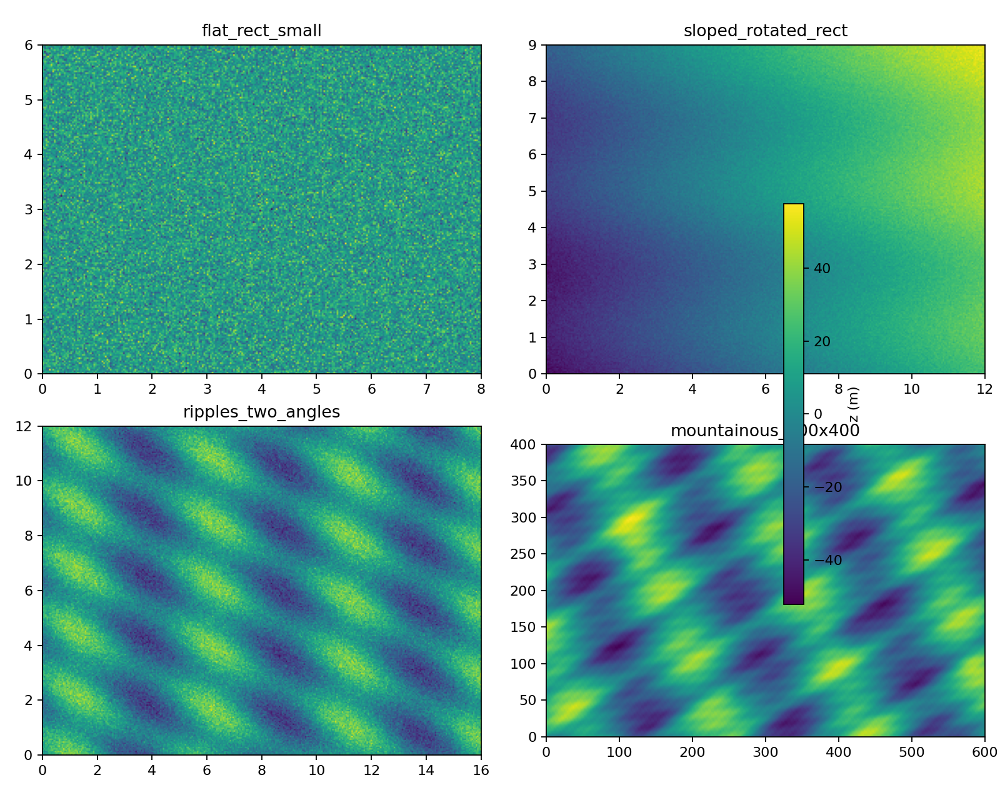
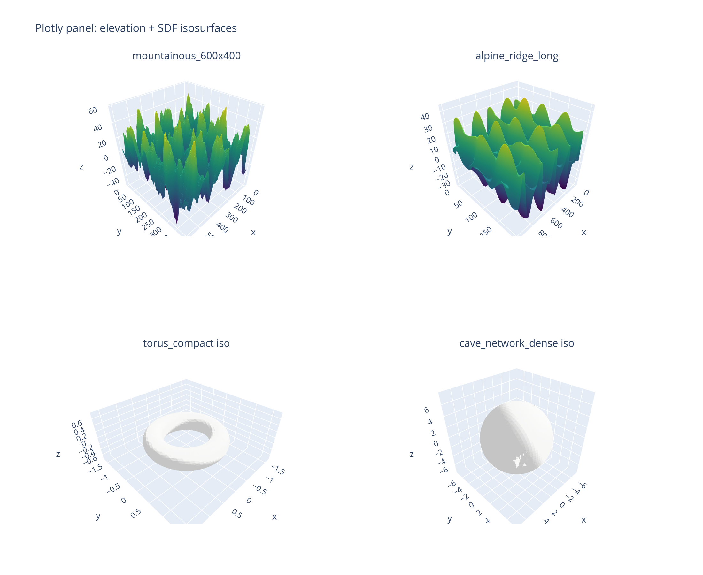

# surface-scenarios

Standalone synthetic elevation and 3D SDF scenario library. Ships procedural generators, bundled manifests, and lightweight loaders that return pandas DataFrames plus analytic truth functions.

## Install
```
pip install surface-scenarios
```
(Python import remains `survi_scenarios` for compatibility.)

## Environment overrides
- `SURVI_SCENARIO_MANIFEST`: custom path for the elevation suite manifest.
- `SURVI_SDF_MANIFEST`: custom path for the SDF manifest.

## Quickstart: elevation
```python
import matplotlib.pyplot as plt
from survi_scenarios import list_elevation_scenarios, load_elevation_scenario

name = list_elevation_scenarios()[0]
ds = load_elevation_scenario(name)
print(ds.summary())

# simple surface plot
grid = ds.samples.pivot(index="y", columns="x", values="z")
plt.imshow(grid.values, origin="lower",
           extent=[grid.columns.min(), grid.columns.max(),
                   grid.index.min(), grid.index.max()])
plt.title(name)
plt.colorbar(label="z (m)")
plt.show()
```

## Quickstart: 3D SDF
```python
from survi_scenarios import load_sdf_scenario
import numpy as np

sdf = load_sdf_scenario("torus_compact", seed=0)
pts = sdf.raw_surface[["x","y","z"]].to_numpy()[:5]
print("phi", sdf.truth_phi(pts))
```

## Visualize four scenarios in a panel
Rendered with `python scripts_generate_panel.py`:



Regenerate the image locally:
```bash
python scripts_generate_panel.py
```

## Plotly panel (2x2)
Generated with `python scripts_generate_plotly.py` (uses plotly + kaleido; script will download a local Chromium if needed).



## Tests
```
PYTHONPATH=src pytest tests -q
```

## Install
```
pip install surface-scenarios
```
